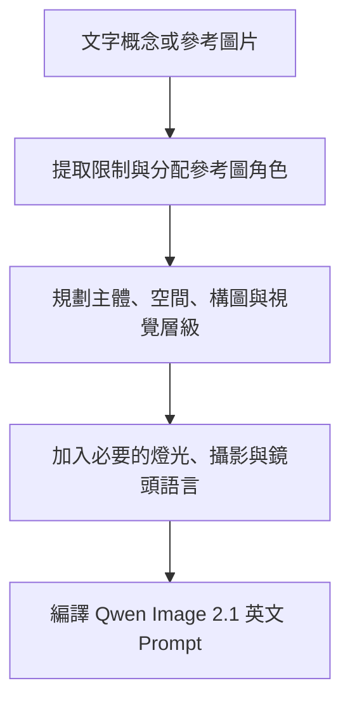

<p align="center">
  
</p>

<h1 align="center">Qwen Image 2.1 Prompt</h1>

<p align="center">
  將簡單的視覺概念、草稿或參考圖片，整理成可直接用於 Qwen Image 2.1 的 production-ready English prompt。
</p>

<p align="center">
  <a href="SKILL.md">Skill Instructions</a> ·
  <a href="#安裝方式">Installation</a> ·
  <a href="#使用範例">Examples</a> ·
  <a href="#知識模組">Knowledge Modules</a>
</p>

---

## 這個 Skill 解決什麼問題？

使用者通常知道自己「想要什麼畫面」，但不一定會把人物、構圖、光線、空間、鏡頭與參考圖關係說完整。

這個 Skill 會先整理視覺需求，再將需求編譯成結構清楚、具體且可執行的英文 Prompt。它特別重視：

- 保留人物、角色 IP、服裝、姿勢與物件等明確限制
- 建立前景、中景、背景與左右位置關係
- 處理單張或多張參考圖的角色分工
- 鎖定需要保留的身份、造型與畫面特徵
- 將電影攝影、燈光、機種與鏡頭語言轉換為靜態影像描述
- 避免空泛品質標籤、互相衝突的指令與無意義堆詞
- 依照用途輸出適合的長寬比

## 核心工作流程



Skill 內部採用兩階段處理：

1. **Visual Planning**  
   整理主體數量、身份、外觀、服裝、動作、場景、構圖、光線、風格、文字與禁止項目。

2. **Prompt Compilation**  
   將視覺規劃轉成連貫、具體、可直接使用的英文 Prompt，並保留圖片內指定文字的原始語言。

## 主要能力

| 類型 | 支援內容 |
|---|---|
| 文字生圖 | 人像、角色、商品、場景、海報、社群圖、透明貼圖 |
| 參考圖 | 身份保留、角色一致性、服裝參考、姿勢參考、風格參考 |
| 多參考圖 | 為每張圖片分配 identity、clothing、pose、composition、environment 等角色 |
| 圖像修改 | 指定保留與可變更項目，重新設計場景或視覺表現 |
| 構圖控制 | 景別、視角、透視、左右位置、留白、前中後景與遮擋關係 |
| 電影攝影 | 敘事功能、鏡位、燈光系統、色彩、景深與畫面質感 |
| 機種與鏡頭 | 將電影攝影機、Cooke、現代電影鏡與東德／蘇聯老鏡特色轉成可見的靜態影像語言 |
| 圖中文字 | 保留原文，指定位置、字重、顏色、尺寸與對齊方式 |
| 透明素材 | RGBA、完整透明背景、alpha channel、無牆面與無地板 |

## 安裝方式

### 方法一：使用 Skill Installer

在 Codex 中輸入：

```text
Use $skill-installer to install the skill from:
https://github.com/ZACK-TW/qwen-image-2-1-prompt
```

### 方法二：安裝為個人 Skill

```bash
git clone https://github.com/ZACK-TW/qwen-image-2-1-prompt.git \
  ~/.agents/skills/qwen-image-2-1-prompt
```

安裝在使用者層級後，可在不同專案中使用。

### 方法三：安裝到特定專案

在專案根目錄執行：

```bash
mkdir -p .agents/skills
git clone https://github.com/ZACK-TW/qwen-image-2-1-prompt.git \
  .agents/skills/qwen-image-2-1-prompt
```

這種方式會讓 Skill 跟著專案一起管理，適合團隊或特定影像工作流。

## 如何叫用

- **ChatGPT：** 輸入 `@` 並選擇 **Qwen Image 2.1 Prompt**
- **Codex CLI／IDE：** 輸入 `$qwen-image-2-1-prompt`
- **自動觸發：** 安裝後，當任務符合 Skill 描述時，系統可自動選用

## 使用範例

### 1. 從簡單概念建立完整 Prompt

```text
Use $qwen-image-2-1-prompt.

一名 40 歲台灣男性坐在深夜便利商店窗邊，
剛下班，手上拿著已經冷掉的咖啡。
9:16，不要出現文字。
```

### 2. 使用人物與服裝參考圖

```text
Use $qwen-image-2-1-prompt.

圖 1 保留人物身份與臉部特徵。
圖 2 只參考西裝款式。
讓人物站在台北現代辦公大樓的落地窗前，
身體朝左約 30 度，看向鏡頭，16:9。
```

### 3. 將電影鏡頭美學用於靜態圖片

```text
Use $qwen-image-2-1-prompt.

製作一張溫暖但不過度復古的人像攝影 Prompt。
希望帶有 Cooke 式柔和膚色、自然焦外與輕微高光暈染，
仍保留現代商業攝影的清晰度。
```

### 4. 製作透明背景貼圖

```text
Use $qwen-image-2-1-prompt.

一隻疲憊但仍努力站著的擬人柴犬，
成人比例的 Q 版角色，手拿咖啡。
完整透明背景，不要文字，不要地面陰影，1:1。
```

## 輸出格式

### 文字生圖

```text
【Qwen Image 2.1 Prompt】

<complete English prompt>

【Aspect Ratio】

<ratio>
```

### 含參考圖片

```text
【Reference Roles】

<image1>: <role>
<image2>: <role>

【Qwen Image 2.1 Prompt】

<complete English prompt>

【Aspect Ratio】

<ratio>
```

## 知識模組

| 檔案 | 用途 |
|---|---|
| [`SKILL.md`](SKILL.md) | 任務路由、兩階段編譯流程、共通限制與輸出規格 |
| [`references/text-to-image.md`](references/text-to-image.md) | 純文字需求的視覺規劃與 Prompt 編譯 |
| [`references/reference-image.md`](references/reference-image.md) | 單張／多張參考圖的角色分工、優先級與資訊防串用 |
| [`references/cinematography-language.md`](references/cinematography-language.md) | 景別、視角、構圖、運鏡轉譯、燈光、色彩與敘事功能 |
| [`references/camera-and-lens-looks.md`](references/camera-and-lens-looks.md) | 電影機種、Cooke、現代電影鏡、東德與蘇聯老鏡的靜態影像特徵 |
| [`agents/openai.yaml`](agents/openai.yaml) | 顯示名稱、預設提示與叫用設定 |
| [`assets/icon.svg`](assets/icon.svg) | Skill 圖示 |

## 設計原則

- 先規劃畫面，再撰寫 Prompt
- 明確條件的優先級高於裝飾性細節
- 使用可見、可描述的影像結果表達器材特性
- 維持人物數量、方向、接觸關係與空間邏輯
- 只加入真正影響畫面的攝影與渲染資訊
- 不預設加入 negative prompt
- 不使用 `masterpiece`、`best quality`、`8K` 等空泛品質詞

## 使用範圍與限制

- 本專案提供 Prompt 規劃與編譯規則，未包含 Qwen Image 2.1 模型、API 或生圖服務。
- Skill 預設輸出英文影像 Prompt；圖片內指定文字會保留原始語言。
- 除非使用者同時要求生成圖片，Skill 只輸出 Prompt。
- 最終成像仍會受到模型版本、工作平台、輸入圖片與生成參數影響。

## 專案結構

```text
qwen-image-2-1-prompt/
├── SKILL.md
├── agents/
│   └── openai.yaml
├── assets/
│   └── icon.svg
└── references/
    ├── camera-and-lens-looks.md
    ├── cinematography-language.md
    ├── reference-image.md
    └── text-to-image.md
```

## 維護者

Created and maintained by [ZACK-TW](https://github.com/ZACK-TW).

如果你在實際生成中遇到 Prompt 失真、參考圖資訊互相污染、構圖方向錯誤或鏡頭語言不穩定，歡迎透過 GitHub Issues 提供案例。
